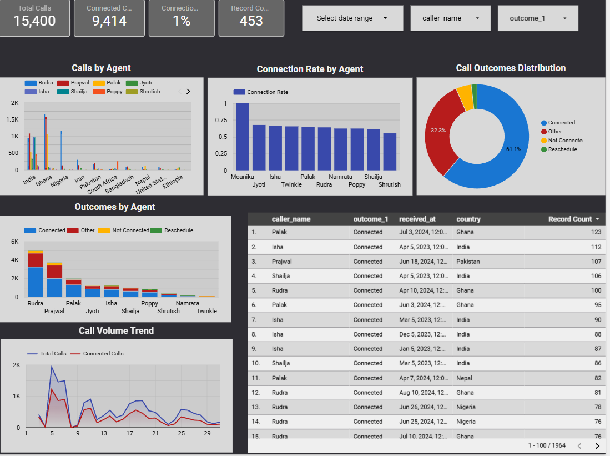

# 🎓 University Admissions & Outreach Analytics Dashboard

### **Live Dashboard**: [View Looker Studio Report](https://lookerstudio.google.com/reporting/d99e0f2d-46a2-4cbf-a2c2-8566be8a91c9/page/zCrfF/edit)

---

## 📖 **Project Overview**

This project demonstrates an end-to-end data engineering and visualization pipeline designed to track and analyze university admission outreach campaigns. The goal was to consolidate fragmented data from multiple sources (Applicant data, Campaign details, and Outreach logs) to gain actionable insights into call connectivity, campaign effectiveness, and student admission statuses.

The final output is an interactive **Looker Studio Dashboard** powered by a **PostgreSQL** database, providing stakeholders with real-time visibility into the admissions funnel.

---

## 🛠️ **Tech Stack**

* **Data Processing:** Python (Pandas), SQL
* **Database:** PostgreSQL
* **Visualization:** Google Looker Studio
* **Data Sources:** CSV (Raw CRM Data)

---

## 🔄 **Data Architecture & Workflow**

The project follows a classic **ETL (Extract, Transform, Load)** pipeline:

1.  **Extract:** Raw data was collected in CSV format representing three distinct entities:
    * **Applicants:** Personal details and application IDs.
    * **Campaigns:** Metadata about specific recruitment drives (e.g., "GR GS SP25 Campaign").
    * **Outreach:** Call logs, timestamps, and caller outcomes.
2.  **Transform:**
    * Data cleaning performed to handle missing values and standardize formats.
    * Merged the three datasets using `App_ID`, `Reference_ID`, and `Campaign_ID` as primary/foreign keys.
    * Standardized date formats for time-series analysis.
    * Created the final master dataset: `cleaned_file.csv`.
3.  **Load:**
    * The cleaned dataset was uploaded to a **PostgreSQL** database to ensure structured storage and query capability.
4.  **Visualize:**
    * Connected Looker Studio to the PostgreSQL instance to build the interactive dashboard.

---

## 📂 **Dataset Description**

### 1. **ApplicantData.csv** (Raw)
Contains demographic information about the students.
* `App_ID`: Unique identifier for the applicant.
* `Country`: Applicant's country of residence.
* `University`: Target university (e.g., Illinois Institute of Technology).

### 2. **CampaignData.csv** (Raw)
Details about the specific marketing or calling campaigns.
* `ID`: Unique campaign identifier (e.g., IANF23).
* `Name`: Descriptive name of the campaign.
* `Category`: Admission stage (e.g., Pre-Admission, Post-Admission).
* `Intake`: Academic year target (e.g., AY2024).

### 3. **OutreachData.csv** (Raw)
Log of all calls made by the outreach team.
* `Reference_ID`: Links to the Applicant ID.
* `Caller_Name`: Name of the agent making the call.
* `Outcome_1`: Result of the call (Connected, Not Connected, Reschedule).
* `Campaign_ID`: Links to the Campaign ID.

### 4. **cleaned_file.csv** (Processed)
The final merged dataset used for the dashboard, combining all the above fields into a single analytical view.

---

## 📊 **Dashboard Features & Insights**

The Looker Studio dashboard provides the following insights:

* **Call Outcomes:** Visual breakdown of "Connected" vs. "Not Connected" calls.
* **Campaign Performance:** Analysis of which campaigns (e.g., "Deferrals to SP25") are generating the most engagement.
* **Geographic Distribution:** Insights into which countries (India, Nigeria, Ghana, etc.) are being targeted.
* **Agent Productivity:** Performance tracking for individual callers (e.g., Jyoti, Shailja, Isha).
* **Temporal Trends:** Call volume analysis over time (months/years).

---
